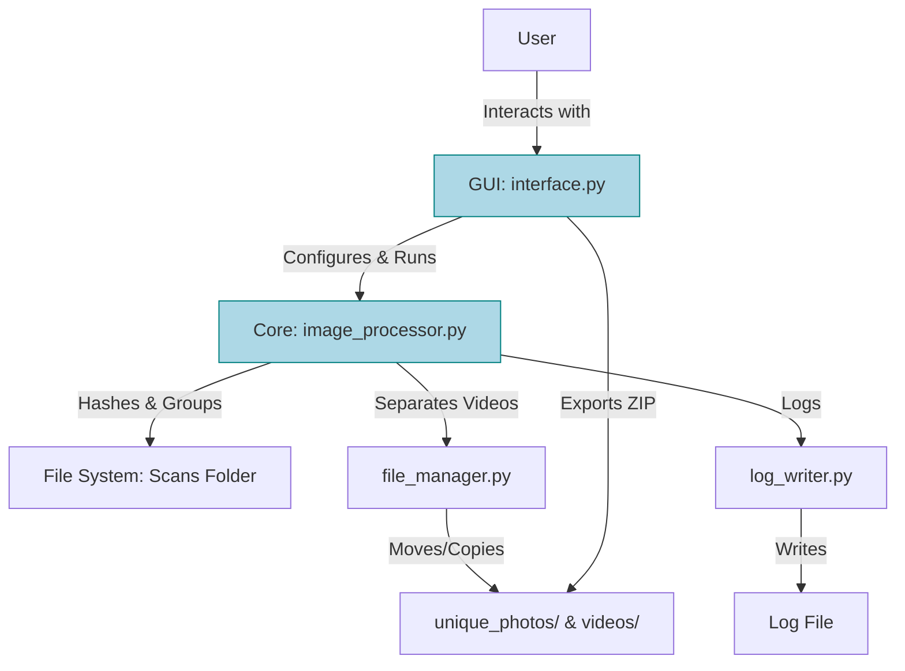

# Picture Finder

[](https://www.python.org/downloads/)
[](https://opensource.org/licenses/MIT)
[](https://github.com/Irish3434/devlab/actions)

**Picture Finder** - A polished, professional Python application for detecting and managing duplicate images in large photo collections (up to 300,000+ files). Features perceptual hashing for accurate duplicate identification, automatic video separation, and user-configurable copy/move operations with timestamped filenames.

## Features

### Core Functionality
- **🔍 Advanced Duplicate Detection**: Multi-algorithm support (average, perceptual, difference, wavelet hashing) with intelligent caching
- **📹 Smart Video Separation**: Automatically detects and organizes videos with size-based validation
- **📁 Intelligent Organization**: Copy/move operations with timestamp-based naming and conflict resolution
- **🚀 Performance Optimized**: Dynamic thread allocation, batch processing, and comprehensive performance monitoring

### User Experience
- **🎨 Accessible GUI**: Professional interface with high-contrast mode, keyboard navigation, and enhanced tooltips
- **📦 Secure Export**: Password-protected ZIP compression with multiple security layers
- **🌍 Multi-language Support**: Internationalization ready (English, Spanish, French)
- **⚙️ Advanced Configuration**: Persistent settings with validation and easy customization

### Technical Excellence
- **📊 Performance Monitoring**: Real-time metrics, cache hit rates, and detailed analytics
- **🔒 Security First**: Path sanitization, file validation, and permission checking
- **🧩 Plugin Architecture**: Extensible hash algorithm system for future enhancements
- **📋 Comprehensive Logging**: Multi-format output with performance profiling

## System Architecture



## Quick Start

1. **Clone the repository:**
   ```bash
   git clone https://github.com/Irish3434/devlab.git
   cd devlab/PictureFinder
   ```

2. **Set up Python environment:**
   ```bash
   python -m venv .venv
   source .venv/bin/activate  # On Windows: .venv\Scripts\activate
   pip install -r requirements.txt
   ```

3. **Run the application:**
   ```bash
   python app.py
   ```

## Usage

1. **Select Folder**: Browse and select the folder containing your photos
2. **Configure Settings**: 
   - Adjust similarity threshold (default: 10)
   - Set batch size (default: 500)
   - Choose CPU/RAM usage mode
3. **Choose Action**: Select Copy or Move for non-duplicate files
4. **Process**: Click Run to start duplicate detection
5. **Export**: Optionally export unique photos as ZIP file

## Requirements

- **Python**: 3.12 or higher
- **Operating System**: Windows, macOS, or Linux
- **Memory**: 4GB RAM minimum (8GB+ recommended for large collections)
- **Storage**: Additional space equal to your photo collection size

## Project Structure

```
PictureFinder/
├── app.py                     # Main application entry point
├── requirements.txt           # Dependencies
├── setup.py                  # Package configuration
├── core/                     # Core functionality
│   ├── image_processor.py    # Duplicate detection and hashing
│   ├── file_manager.py       # File operations and video separation
│   └── log_writer.py         # Logging system
├── gui/                      # User interface
│   ├── interface.py          # Main GUI components
│   └── styles.py             # UI styling and theming
├── tests/                    # Unit tests
├── docs/                     # Documentation
├── assets/                   # Icons and localization files
└── .github/workflows/        # CI/CD configuration
```

## Development

### Local Setup

1. **Install development dependencies:**
   ```bash
   pip install -r requirements.txt
   ```

2. **Run tests:**
   ```bash
   pytest --cov
   ```

3. **Lint code:**
   ```bash
   pylint **/*.py
   ```

### Contributing

1. Fork the repository
2. Create a feature branch (`git checkout -b feature/amazing-feature`)
3. Commit your changes (`git commit -m 'Add amazing feature'`)
4. Push to the branch (`git push origin feature/amazing-feature`)
5. Open a Pull Request

## Performance

- **Small Collections** (<1,000 files): Processes in seconds
- **Medium Collections** (1,000-10,000 files): Processes in minutes
- **Large Collections** (10,000+ files): Optimized batching and multiprocessing

## Security

- Input validation and path sanitization
- No shell command execution
- Secure file operations with permission checks
- User-selected folder restrictions

## License

This project is licensed under the MIT License - see the [LICENSE](LICENSE) file for details.

## Support

- 📖 **Documentation**: See `docs/user_guide.md` for detailed instructions
- 🐛 **Issues**: Report bugs on [GitHub Issues](https://github.com/Irish3434/devlab/issues)
- 💬 **Discussions**: Join discussions on [GitHub Discussions](https://github.com/Irish3434/devlab/discussions)

---

Made with ❤️ by the Picture Finder Team